# The-Regulatory-Roles-of-lncRNAs-and-miRNAs-in-Breast-and-Prostate-Cancer-in-Men
RNA-seq–based analysis of lncRNAs and miRNAs in male breast and prostate cancer to identify regulatory mechanisms and potential biomarkers.
***Senior Research Project - Istanbul Bilgi University*** <br>
***Supported by TUBITAK 2209-A*** <br>
**Date:** *2025-06-27* <br>


## Methodology
This section describes the proposed methodology, which includes dataset selection, preprocessing and analysis. Datasets from the [NCBI GEO](\url{https://www.ncbi.nlm.nih.gov/geo/}) will be aligned using `STAR` and `Bowtie2`, while quality control and feature counts will be generated using `SAMtools`. Differential expression analysis will be conducted with `DESeq2` and key genes will be identified through pathway mapping with KEGG and a review of relevant literature. Additionally, intersection analysis across datasets will focus on highlighting common molecules (lncRNAs, miRNAs, mRNAs, and transcription factors) to enhance understanding of gene functions and interactions. The scheme/pipeline followed to carry out the project is shown in 

<figure id="pipeline">
    
<figcaption><strong>Figure 1.</strong>Followed pipeline of the project.</figcaption>
</figure>

## Step 1 - Data Collection
In this study, datasets were initially searched in the *[NCBI GEO](\url{https://www.ncbi.nlm.nih.gov/geo/}) (National Center for Biotechnology Information / Gene Expression Omnibus)* and [TCGA](\url{https://www.cancer.gov/ccg/research/genome-sequencing/tcga})(The Cancer Genome Atlas) data repositories. During dataset selection, particular attention was paid to include raw data generated from **fresh frozen** tissue samples using next-generation sequencing (NGS) platforms. 

📚 The preference for fresh frozen tissues is based on reports indicating that NGS data obtained from formalin-fixed, paraffin-embedded (FFPE) samples often display smaller library sizes and exhibit increased C-to-T transitions, particularly at CpG dinucleotides, suggesting a possible interaction between DNA methylation and formalin-induced modifications (Spencer et al., 2013)

All datasets in the NCBI GEO database included tumor breast tissue samples from male breast cancer patients. Therefore, additional searches were conducted within the TCGA GDC Data Portal to identify normal breast tissue samples from male subjects. Tables below summarize the datasets obtained from GEO and TCGA.

###### Table 1. Selected datasets from NCBI GEO

| GSE Code   | Tumor Data | Normal Data | Region   | Gender |
|------------|-----------|------------|----------|--------|
| GSE229571  | 6         | 6          | Breast   | Female |
| GSE210787  | 6         | 6          | Breast   | Female |
| GSE71651   | 9         | 2          | Breast   | Female |
| GSE104730  | 46        | 0          | Breast   | Male   |
| GSE133626  | 13        | 12         | Prostate | Male   |
| GSE181294  | 20        | 18         | Prostate | Male   |
| GSE229904  | 93        | 29         | Prostate | Male   |

---

###### Table 2. Selected dataset from TCGA GDC Portal

| Sample ID        | Tissue Type | Region  | Gender |
|------------------|------------|--------|--------|
| TCGA-BH-A0DD-11A | Normal     | Breast | Male   |

---

> **Note:** GEO datasets include both male and female samples, while TCGA data is limited to a single male breast sample.

Before proceeding with raw data analysis, the "SRA Toolkit" was installed on the computational system via the command line (bash environment). The datasets were subsequently downloaded using the "`prefetch SRRXXXXXX`" or "`prefetch GSEXXXXXX`" command. It depends on the usable data which in the dataset. If the entire dataset is to be downloaded, the prefetch command can be used with the GSE accession number (e.g., `prefetch GSEXXXXXX`). Alternatively, to download specific runs, the command should be applied with individual SRR accession numbers (e.g., `prefetch SRRXXXXXX`).

The downloaded files in "`.sra`" format were converted into paired-end or single-end read files in "`.fastq`" format.

- **Command used for `.sra` file extraction:** `fastq-dump --split-files --skip-technical *.sra`  
  *In Bash, the asterisk symbol (`*`) is a wildcard that matches any number of characters. When used as `*.extension`, it refers to all files that end with the specified extension. For example, `*.sra` matches all files in the directory that have the `.sra` extension.*

- **Output:**
  - If the file has paired-end reads: "`SRRXXXXXX_1.fastq`" and "`SRRXXXXXX_2.fastq`"
  - If the file has single-end reads: "`SRRXXXXXX_1.fastq`"

The resulting `.fastq` files were categorized into three groups: female breast, male breast, and prostate datasets.

### FastQC and Fastp Analysis

To assess the quality of sequencing reads prior to alignment, FastQC was applied to datasets designed to be processed with the STAR aligner. FastQC provided detailed visual and statistical summaries of quality metrics such as base sequence quality, GC content, and adapter contamination. Given that STAR alignment provides the most precise measurements possible, no additional trimming was performed for the STAR alignment data.

In contrast, datasets aligned using Bowtie2 were preprocessed with fastp, a tool that automatically performs adapter trimming, quality filtering, and per-read quality control according to predefined thresholds. Since fastp performs the trimming internally, no separate quality check with FastQC was required before Bowtie2 alignment. This approach ensured that only high-quality reads were passed to the alignment step.

- **Command used for FastQC analysis:** `fastqc *.fastq`

- **Output:** "`SRRXXXXXX_1_fastq.html`"

- **Command used for fastp analysis:**
  - Paired-end reads: `fastp -i SRRXXXXXX_1.fastq -I SRRXXXXXX_2.fastq -o SRRXXXXXX_1.trimmed.fastq -O SRRXXXXXX_2.trimmed.fastq -j SRRXXXXXX_fastp.json`
  - Single-end reads: `fastp -i SRRXXXXXX.fastq -o SRRXXXXXX.trimmed.fastq -j SRRXX\\XXXX_fastp.json`

- **Output:** "`SRRXXXXXX_fastp.json`"


The data obtained as a result of FastQC analysis are reported under 11 main headings to evaluate the sequencing quality. These headings provide a basic reference to identify possible quality problems in the raw data and to plan the necessary pre-processing.
- Basic Statistics
- Per base sequence quality
- Per tile sequence quality
- Per sequence quality scores
- Per base sequence content
- Per sequence GC content
- Per base N content
- Sequence Length Distribution
- Sequence Duplication Levels
- Overrepresented sequences
- Adapter Content

[Figure 2.](#fastqc) shows the basic statistical output of the FastQC analysis of only the file SRR24150264_2.fastq among hundreds of samples. The file contains a total of 33,956,736 reads, which correspond to a total of approximately 5 Gbp of data. Each read is 150 bases long and has a fixed length. No reads were marked as low quality, indicating that the data in this sample is of high quality. Furthermore, the GC content in this sample was determined to be 51%, which is in line with the expected range of 40–60% in organisms. The sequence data is in Sanger/Illumina 1.9 format for quality scores and is compatible with current analysis tools.

<figure id="fastqc">
    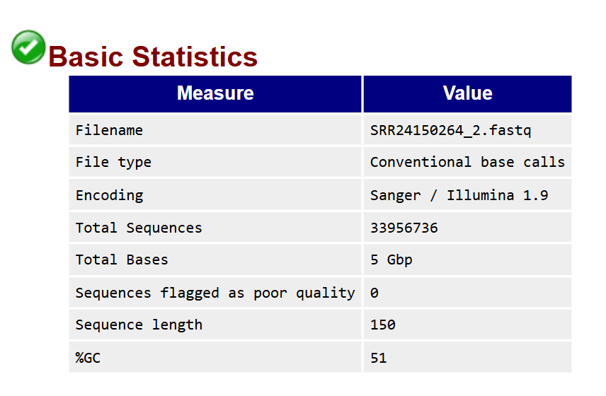
<figcaption><strong>Figure 2.</strong>Provides information about basic statistics of FastQC report.</figcaption>
</figure>

 
[Figure 3.](#base) shows the distribution of quality scores at each base position of the analyzed sequences. The Y-axis shows the Phred quality scores, and the X-axis shows the base positions along the read. Each box represents the quality distribution of all sequences at that position.<br>In this example, from the beginning of the read to about base 100, the quality scores are in the Phred score range of 34–36, indicating very high quality. After base 100, there is a slight decrease in quality scores, with average scores dropping to around 30 towards the last bases. However, these values are still within high confidence limits and indicate that the overall data quality is high.

<figure id="base">
    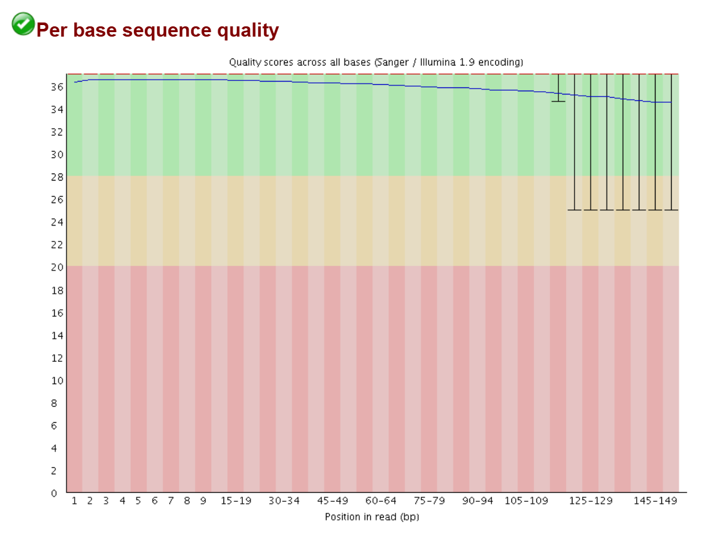
<figcaption><strong>Figure 3.</strong>Demonstrates per base sequence qualities of data.</figcaption>
</figure>

[Figure 4.](#tile) shows the quality scores measured in different tile regions in the flow cell of the sequencing device. The tile numbers are on the Y-axis and the base positions are on the X-axis. All regions are dark blue, indicating that the quality scores are consistent and high.
<figure id="tile">
    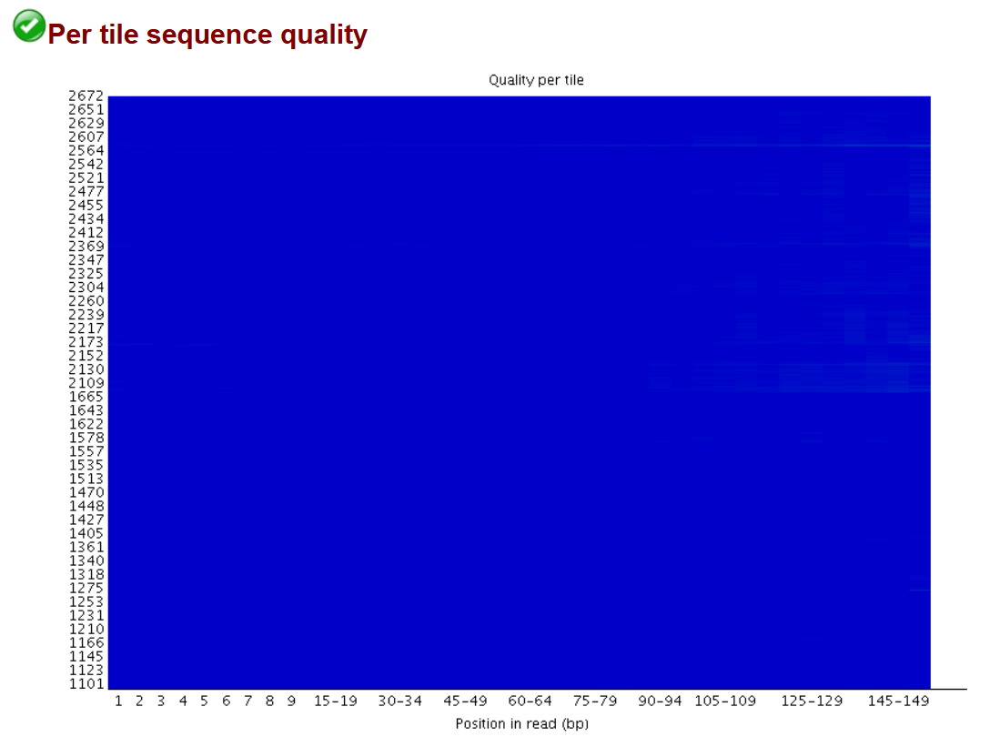
<figcaption><strong>Figure 4.</strong>Demonstrates per tile sequence quaity.</figcaption>
</figure>


[Figure 5.](#psq) shows the distribution of average quality scores for each sequence. The horizontal axis represents the Phred scores, and the vertical axis represents the number of sequences with that quality. The vast majority of all sequences clustered around the Phred score of 36, indicating that the data is of very high quality. There is no cluster of low quality sequences observed in the graph, indicating that no pre-filtering or trimming was required for the analysis.
<figure id="psq">
    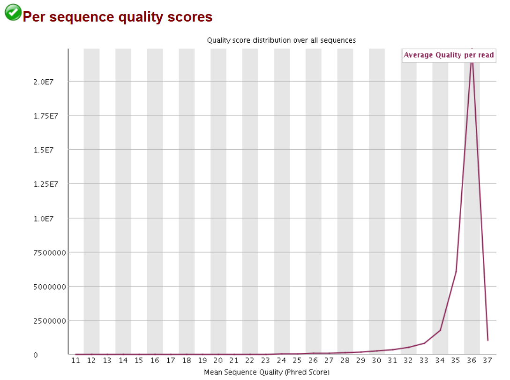
<figcaption><strong>Figure 5.</strong>Demonstrates per sequence quaity of the data.</figcaption>
</figure>

[Figure 6.](#pbsq) shows the distribution of the ratios of four nucleotides (A, T, G, C) at each base position. Base ratios fluctuate at the beginning of the read (first 10–12 bases), then stabilize.
<figure id="pbsq">
    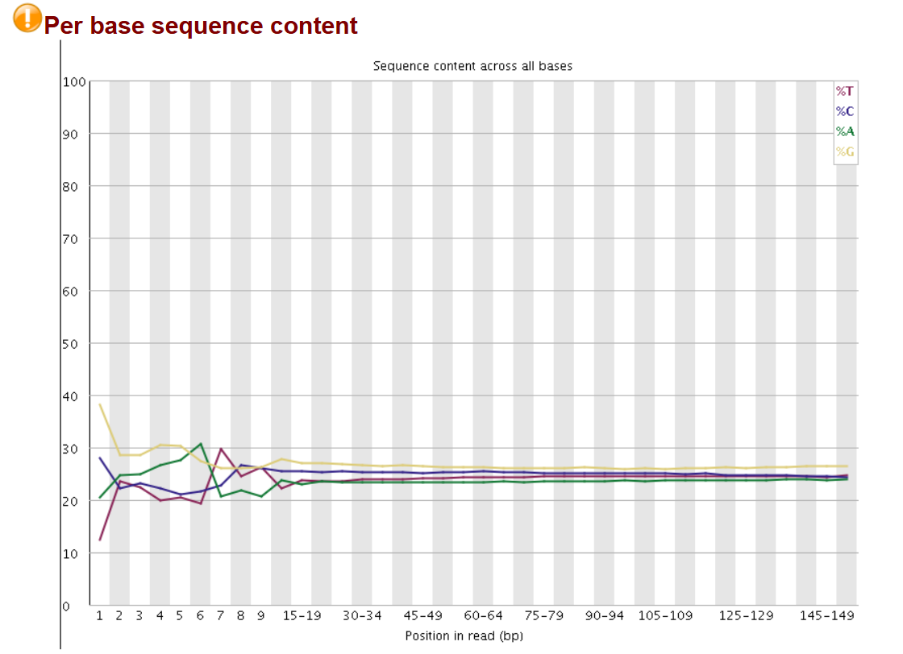
<figcaption><strong>Figure 6.</strong>Demonstrates per base sequence content of the data.</figcaption>
</figure>


[Figure 7.](#gc) shows the distribution of the average percentage of GC contained in each read (red curve) compared to the theoretical normal distribution (blue curve). GC content is concentrated around 51\% in the dataset, which is consistent with the biologically expected range.
<figure id="gc">
    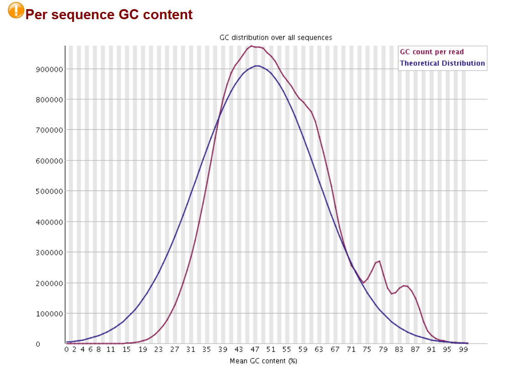
<figcaption><strong>Figure 7.</strong>Demonstrates per sequence GC content of the data.</figcaption>
</figure>


[Figure 8.](#pbn) shows the ratio of undefined nucleotides (N) at each base position. The \%N ratio is close to zero across all positions, and no significant N accumulation is observed in any region. This shows that there was no base identification error during the sequencing process and the data was obtained with high accuracy.
<figure id="pbn">
    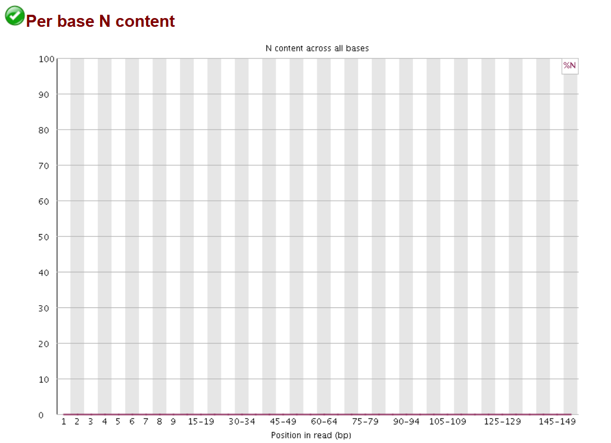
<figcaption><strong>Figure 8.</strong>Demonstrates per base N content of the data.</figcaption>
</figure>


[Figure 9.](#length) shows the length distribution of the analyzed sequences. All sequences are almost exactly 150 base pairs long and the distribution is in the form of a single, narrow peak.This shows that the data were sequenced to a fixed length and there was no trimming, adapter residues or length heterogeneity.
<figure id="length">
    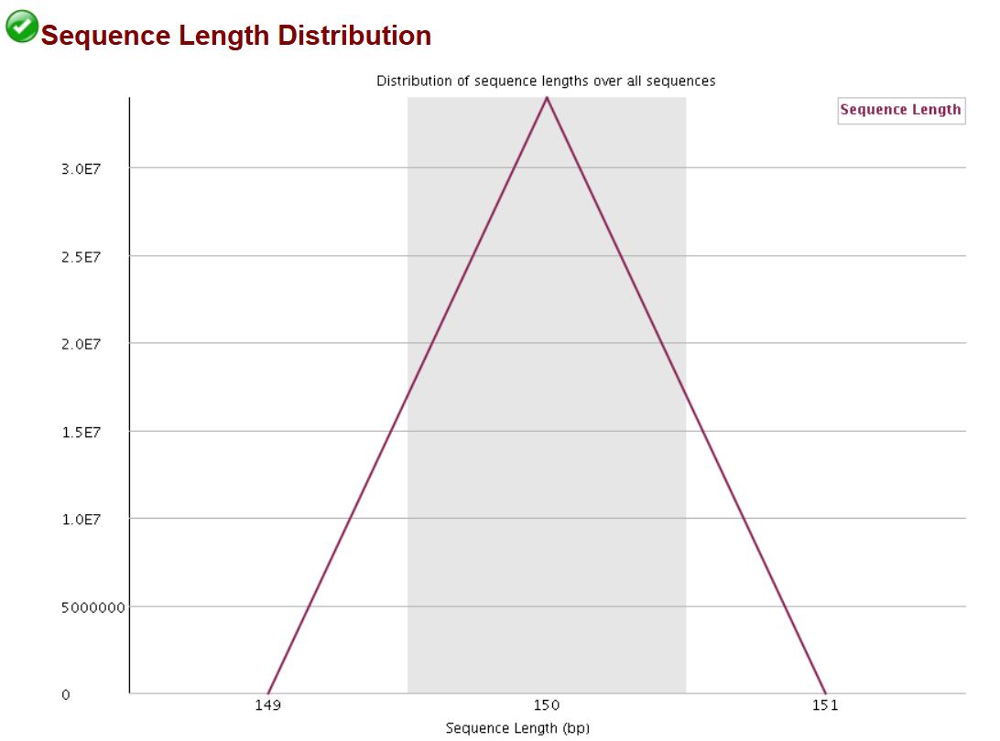
<figcaption><strong>Figure 9.</strong>Demonstrates sequence length distribution of the data.</figcaption>
</figure>

[Figure 10.](#duplication) shows the percentage of repeated (duplicated) sequences in the array. The Y-axis shows the total percentage of sequences, and the X-axis shows the number of times a sequence is repeated.According to the analysis, approximately 49.5\% of the data consists of repeated sequences, meaning that if the duplication is removed, only 50.53\% will remain unique.
<figure id="duplication">
    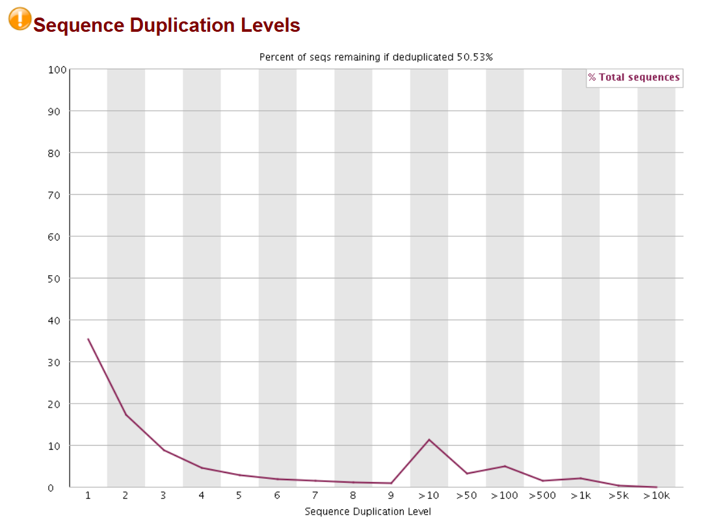
<figcaption><strong>Figure 10.</strong>Demonstrates sequence duplication levels of the data.</figcaption>
</figure>


<figure id="overrepresented">
    
<figcaption><strong>Figure 11.</strong>Demonstrates overrepresented sequences of the data.</figcaption>
</figure>


[Figure 12.](#adapter) shows at which positions along the read the adapter sequences used during sequencing were detected. The Y-axis shows the adapter ratio (\%), and the X-axis shows the base positions. In this example, the adapter signal is very low for all adapter types, with only a very small increase in the last ~20 bases of the read. This indicates a largely clean dataset and suggests that adapter contamination is negligible.
<figure id="adapter">
    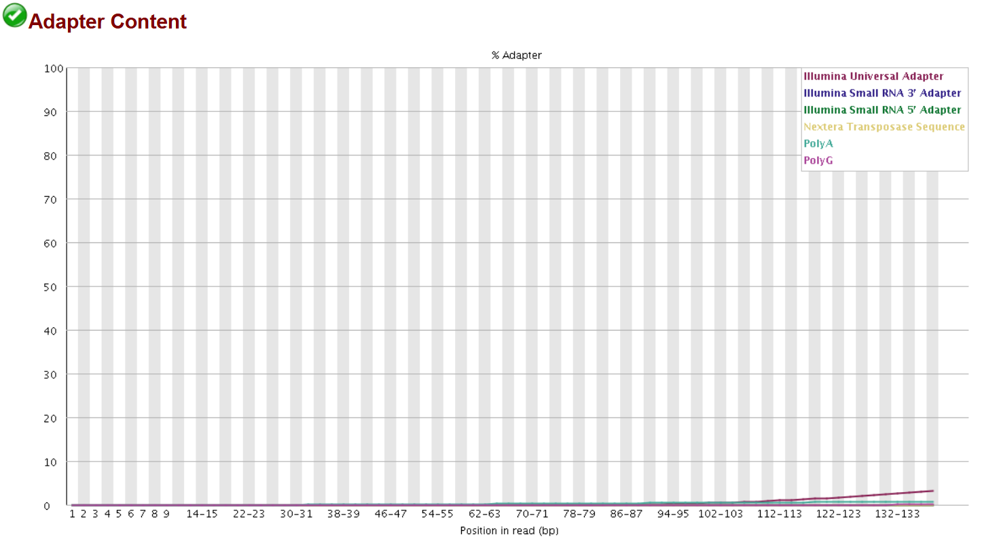
<figcaption><strong>Figure 12.</strong>Demonstrates aadapter contents of the data.</figcaption>
</figure>


When the summary data of the Fastp quality control analysis is examined, it is seen that in [Figure 13.](#fastp), the raw data set is generally of high quality. In this example with a paired-end sequencing design, 150 base reads were performed at both ends and the average read length decreased to 149 bp after filtering processes. This shows that low quality bases that may be located especially at the ends of the read were successfully cleaned. The overall duplication rate of the data was calculated as 18.87\%. Before filtering, a total of 88.3 million reads and 13.2 Gbp of base data were obtained. In these reads, the rate of bases passing the Q20 quality score was 97.94\% and the rate passing Q30 was 94.19\%. These high rates reveal that the base calling operations were performed correctly and reliably to a large extent. The GC content was measured as 50.53\%, and this value is within the 40–60\% range expected from living organisms, indicating that the data is biologically consistent. After the filtering process, a total of 86.1 million reads were obtained, indicating that 97.5\% of the total data passed the quality thresholds and became suitable for analysis. The Q20 and Q30 rates increased to 98.50\% and 95.03\%, respectively, at this stage, confirming that fastp increased the overall quality of the data through filtering and correction processes. The GC rate after filtering was recorded as 50.58\%, indicating that the filtering did not cause any deviation on the GC balance. When the filtering results are examined in detail, it is seen that approximately 2.16 million reads were corrected, 3.94 million bases were individually repaired, and only 2.5\% of the data were eliminated due to low quality. In addition, only 548 reads were excluded because they contained a large number of ambiguous bases (N), and no reads were produced that were too short in length as a result of trimming. The fastp tool used in this analysis is not only a quality assessment tool, but also an integrated one that performs adapter cleaning, low-quality base extraction, read correction and trimming operations. In this respect, it offers significant advantages compared to FastQC. FastQC is quite valuable in terms of visual quality control and graphical output, but it does not perform any correction operations; it only provides information about the status of the data. Fastp automates these analysis steps, reducing both time and processing load, especially in large-scale projects with a large number of samples.
<figure id="fastp">
    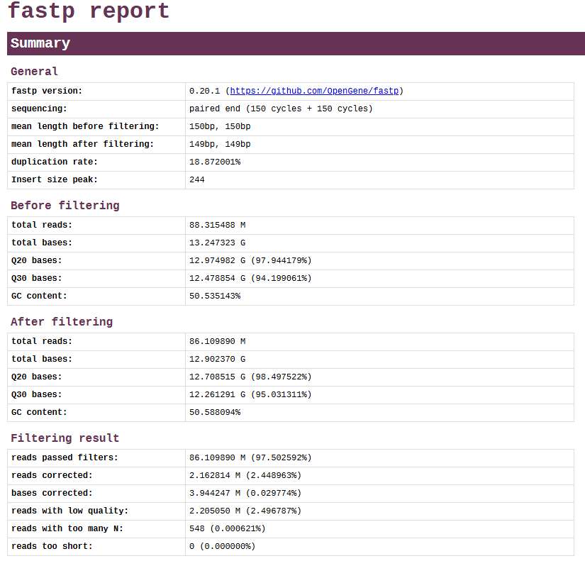
<figcaption><strong>Figure 13.</strong>Demonstrates Fastp report of SRR20982988.</figcaption>
</figure>


## Step 2 - Data Analysis
For the analysis of the datasets, STAR and Bowtie2 alignment tools were installed on the system. In addition, Samtools was installed for downstream processing steps. The installations were performed using the respective GitHub repositories as sources.

#### 🔧 Tools and Installation Sources
- **STAR installation:** https://github.com/alexdobin/STAR/blob/master/README.md  
- **Bowtie2 installation:** https://github.com/BenLangmead/bowtie2  
- **Samtools installation:** https://github.com/samtools/samtools

Before starting both the STAR and Bowtie2 alignments, a file structure was created to keep the data organized ([Figure 14.](#organized)). 
<figure id="organized">
    
<figcaption><strong>Figure 14.</strong>File layout used for STAR and Bowtie2 alignment.</figcaption>
</figure>

The reference genome, **GRCh38.113**, was downloaded from the Ensembl database and integrated into the installed alignment tools for mapping purposes.

The reference genome files are organized within the folder labeled *"ref"*, as illustrated in [Figure 14.](#organized). For a detailed view of the contents and structure of this folder, refer to Figure [Figure 15.](#ref). Key files include `Homo\_sapiens.GRCh38.113.gtf` and `Homo\_sapiens.GRCh38.113\_assembly.fa`, which were utilized as the annotation and genome sequence files, respectively.

All files within the "ref" directory ([Figure 15.](#ref)) were employed in the alignment process using the STAR aligner. In contrast, the folder labeled "genomeDir", shown in [Figure 16.](#genomeDir), was used for alignment with Bowtie2.

The directories presented in [Figure 15.](#ref) and [Figure 16.](#genomeDir) also include the output files generated during the genome indexing steps for STAR and Bowtie2, respectively. The bash commands used for reference genome preparation and integration with the aligners are provided below.

- **STAR index generation:**
```{bash}
STAR --runThreadN 8 --runMode genomeGenerate --genomeDir /path/to/bachelorThesis/ref/genomeIndex --genomeFastaFiles /path/to/bachelorThesis/ref/genome.fa --sjdbGTFfile /path/to/bachelorThesis/ref/annotation.gtf --sjdbOverhang 149`
```
- **Bowtie2 index generation:**
```{bash}
bowtie2-build /path/to/bachelorThesis/ref/genome.fa /path/to/bachelorThesis/genomeDir/bowtie2Index/genome
```

<figure id="ref">
    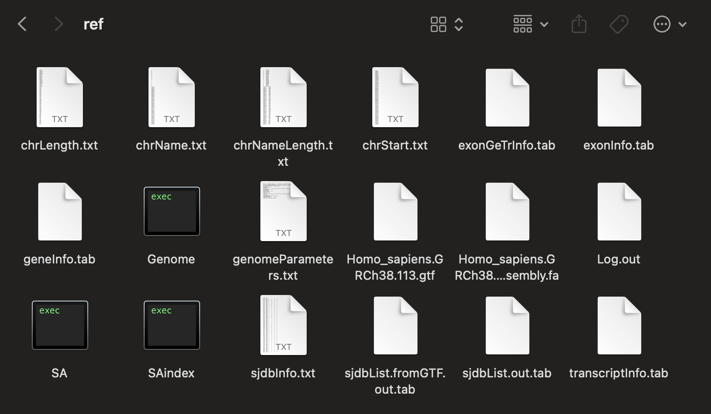
<figcaption><strong>Figure 15.</strong>The file image that is created after the integration of the reference genome documents with the STAR alignment program.</figcaption>
</figure>


<figure id="genomeDir">
    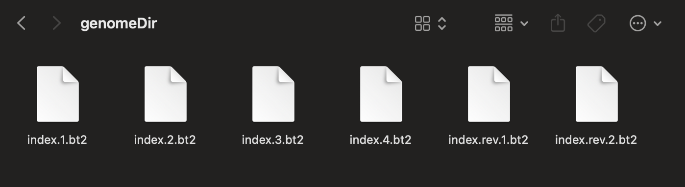
<figcaption><strong>Figure 16.</strong>The file image to be used for Bowtie2, created after integration into the reference genome with the Bowtie2 alignment program.</figcaption>
</figure>


### STAR Alignment


To speed up the alignment process, loop structures were used during command line executions. Documents with the extension `.fastq` obtained in the *"Step-1 Data Collection"* stage and whose quality controls were completed were moved to the file named "fastq" in the file directory specified in Figure [Figure 14.](#organized). Alignment commands with STAR were given according to whether the SRRXXXXXX document was single-ended read or paired-ended read.

- **Paired end datasets:**
```{bash}
for f in *_1.fastq; do STAR --runMode alignReads --genomeDir ../ref/ --outSAMtype BAM SortedByCoordinate --readFilesIn "$f" "${f/_1.fastq/_2.fastq}" --runThreadN 12 --outFileNamePrefix ../mapped/"${f%_1.fastq}"; done
```
- **Single end datasets:**
```{bash}
 for f in *_1.fastq; do STAR --runMode alignReads --genomeDir ../ref/ --readFilesIn "$f" --outSAMtype BAM SortedByCoordinate --runThreadN 12 --outFileNamePrefix ../mapped/"${f%_1.fastq}"; done
```


Upon completion of the alignment, the resulting `.bam` files located in the `mapped` directory were transferred to a newly created directory named `bams_Star` using the `mv` command. (`mv mapped/*.bam bams_Star`)

For read quantification, **Miniconda** was installed and a dedicated conda environment named `rnaseq_env` was created. The environment was activated using `conda activate rnaseq_env`, and the `SUBREAD` (Subread is an open source software package that provides a fast and accurate read aligner and read quantification tool. One of its most well-known components is the featureCounts command.) Package was installed via **Bioconda** repository with the following command: 
```{bash}
conda install -c bioconda subread
```
The system was then prepared for feature counting.

*FeatureCounts* was executed within the `bams_Star` directory using bash. As with alignment, the commands varied depending on whether the datasets contained paired-end or single-end reads:

- **Paired-end dataset:**
```{bash}
featureCounts -p -a /path/to/bachelorThesis/ref/Homo_sapiens.GRCh38.113.gtf -o /path/to/bachelorThesis/STAR_Count.txt -T 12 /path/to/bachelorThesis/bams_Star/*.bam
```

- **Single-end dataset:**
```{bash}
featureCounts -a /path/to/bachelorThesis/ref/Homo_sapiens.GRCh38.113.gtf -o /path/to/bachelorThesis/STAR_Count.txt -T 12 /path/to/bachelorThesis/bams_Star/*.bam
```
The data on which feature counts are made are saved with a .txt extension.


### SUBREAD

Subread is a fast bioinformatics software package designed for the analysis of high-throughput sequencing data. It is used to perform alignment and quantification operations on data such as RNA-Seq and DNA-Seq. One of the most popular components of the package, featureCounts, calculates the number of reads falling into gene regions via genome annotation files (GTF/GFF). Subread works with both single-end and paired-end data and provides high performance with low memory usage. It offers an open source structure, making it easy to integrate with different systems and can be used as an alternative to other alignment tools such as STAR or Bowtie2.

<figure id="subread">
    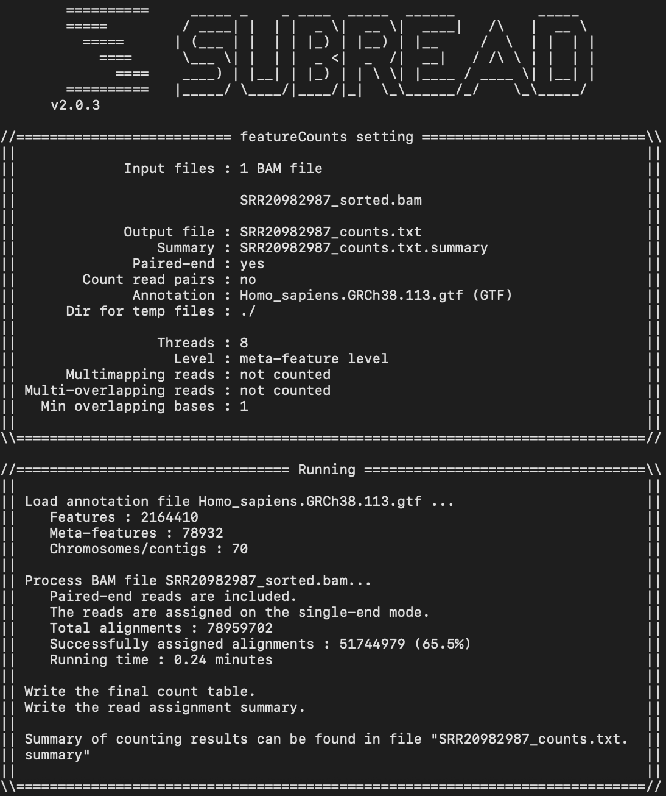
<figcaption><strong>Figure 17.</strong>SUBREAD example of one of the data used.</figcaption>
</figure>


The count matrix was generated using the `featureCounts` function from the Subread package, as shown in [Figure 17.](#subread). Since the data used in this study consist of RNA-Seq reads, the reads were aligned to the reference genome `Homo sapiens` (GRCh38) using a GTF annotation file. The BAM files generated after alignment were then processed to assign read counts to annotated genomic features.

According to the output summary, a total of 78,953,702 alignments were identified, out of which 51,744,979 (65.5\%) were successfully assigned to annotated features. This high assignment rate indicates both the quality of the sequencing data and the accuracy of the alignment step. The annotation file used `Homo_sapiens.GRCh38.113.gtf` and multi-threading with 8 threads contributed to the efficiency of the process, which completed in less than 30 seconds.

A detailed summary of the featureCounts execution, including input/output files, parameters, and assignment statistics, is presented in [Figure 17.](#subread)


### Bowtie2 Alignment
To process RNA-Seq data, a series of command-line steps were followed, starting with alignment and ending with read quantification. The workflow was designed to handle multiple sequencing files in an automated way using a loop structure in Bash. Depending on the sequencing type, either single-end or paired-end commands were used.

The actual alignment was performed using the `bowtie2` tool. For paired-end reads, both forward and reverse FASTQ files were included; for single-end reads, only one file was used. The alignment produced SAM files, which contain the alignment results in a text-based format.

Since SAM files are large and less efficient to process, they were converted into binary BAM format using `samtools view`. Then, to ensure compatibility with downstream tools such as `featureCounts`, the BAM files were sorted using `samtools sort`. After sorting, the original SAM and unsorted BAM files were removed to save space.

Finally, the sorted BAM files were used as input for the `featureCounts` program from the Subread package. This tool counts how many reads are assigned to each gene based on the annotation file (in GTF format). In the case of paired-end data, the `-p` flag was included to count read pairs properly. The output was a gene-level count matrix that could be used in differential expression analysis.

**Paired-End:**

```{bash}
for f in *_1.fastq; do
sample=${f%_1.fastq}

echo ">> Processing $sample"

# 1. Align paired-end reads using Bowtie2
bowtie2 -x GRCh38_index \
-1 ${sample}_1.fastq -2 ${sample}_2.fastq \
-S ${sample}.sam -p 12

# 2. Convert SAM to BAM
samtools view -bS ${sample}.sam > ${sample}.bam

# 3. Sort BAM file
samtools sort ${sample}.bam -o ${sample}_sorted.bam

# 4. Remove intermediate files
rm ${sample}.sam ${sample}.bam

# 5. Generate count matrix with featureCounts
featureCounts -p \
-a Homo_sapiens.GRCh38.113.gtf \
-o ${sample}_counts.txt \
-T 12 ${sample}_sorted.bam

echo ">> Finished processing $sample"
echo ""

done
```


**Single-End:**
```{bash}
for f in *.fastq; do
sample=${f%.fastq}

echo ">> Processing $sample"

# 1. Align single-end reads using Bowtie2
bowtie2 -x GRCh38_index -U $f -S ${sample}.sam -p 12

# 2. Convert SAM to BAM
samtools view -bS ${sample}.sam > ${sample}.bam

# 3. Sort BAM file
samtools sort ${sample}.bam -o ${sample}_sorted.bam

# 4. Remove intermediate files
rm ${sample}.sam ${sample}.bam

# 5. Generate count matrix with featureCounts
featureCounts \
-a Homo_sapiens.GRCh38.113.gtf \
-o ${sample}_counts.txt \
-T 12 ${sample}_sorted.bam

echo ">> Finished processing $sample"
echo ""

done
```
The data on which feature counts are made are saved with a .txt extension.

## Step 3 - Determination of Differential Expressed Genes

The 'feature count' information gathered at the conclusion of Step 2 comprises all genes originating from prostate, breast, and female tissue as well as their malignant conditions. Once the read counts for each gene are known, the crucial challenge is how to extract useful information from this massive dataset. Before performing differential expression analysis (e.g., with DESeq2), all featureCounts outputs must be merged into a single count matrix. First of all, the gene-level read counts obtained from each sample should be combined into one table, where rows represent genes and columns represent samples. This merged count matrix is a required input for most downstream tools in transcriptomic analysis pipelines.


After Feature Count Matrix, reads with .txt extension are obtained. These reads are located in the same folders with their SRR code. Each read in the data set should be collected in a single file. In this way, differential gene expression can be done quickly. Data sets that create data

```{python}
import pandas as pd
import os
import re

base_path   = '/Users/ecemsorucu/Desktop/GSE229904'  # Base directory containing SRR folders
output_path = '/Users/ecemsorucu/Desktop/Bowtie2_Male_Prostate_3.csv'
sep_char    = '\t'  # File delimiter (tab-separated)


def extract_srr_number(folder_name):
    """Extract numeric part from SRR folder name (e.g., 'SRR12345' → 12345)"""
    match = re.search(r'SRR(\d+)', folder_name)
    return int(match.group(1)) if match else float('inf')

df_list = []
processed_files = 0

# Traverse folders in natural sort order
for folder in sorted(os.listdir(base_path), key=extract_srr_number):
    folder_path = os.path.join(base_path, folder)
    if os.path.isdir(folder_path) and folder.startswith("SRR"):
        for file in os.listdir(folder_path):
            if file.endswith('.txt'):
                file_path = os.path.join(folder_path, file)

                df = pd.read_csv(file_path, sep=sep_char, skiprows=1)
                gene_col  = df.columns[0]
                count_col = df.columns[-1]

                df = df[[gene_col, count_col]]
                df = df.drop_duplicates(subset=gene_col)
                df = df.set_index(gene_col)

                df_list.append(df)
                processed_files += 1

print(f"Number of processed .txt files: {processed_files}")

if df_list:
    merged_df = pd.concat(df_list, axis=1)
    merged_df = merged_df.dropna(how='all')
    merged_df.to_csv(output_path)
    print(f"Merged count matrix saved to: {output_path}")
else:
    print("No .txt files found or successfully processed.")
\end{lstlisting}
```

The code given below is the code used to merge the "Male Breast" data sets. With this code, the data received from TCGA, which meets the desired criteria, is merged with the data set downloaded from GEO and analyzed with raw data. The important criterion is that the ensemble ids obtained in the data readings in the TCGA data and the GEO data set can be matched properly. The codes used here are also used for clusters where more than one data set is used. "Female Breast" data sets: GSE229571, GSE210787 and GSE71651; "Prostate" data sets: GSE133626, GSE181294 and GSE229904 were merged by making certain changes to the code below.

```{python}
import pandas as pd

# 1. Read your own featureCounts output file
tumor_df = pd.read_csv("GSE104730_STAR_Count.txt", sep="\t", comment="#")

# 2. Keep only necessary columns (e.g., count data + gene_id)
tumor_df = tumor_df.rename(columns={tumor_df.columns[0]: "gene_id"})
tumor_df["gene_id"] = tumor_df["gene_id"].str.replace(r"\.\d+$", "", regex=True)  # Remove version numbers

# 3. Read TCGA dataset
tcga_df = pd.read_csv("normal_TCGA.csv", sep="\t")
tcga_df["gene_id"] = tcga_df["gene_id"].str.replace(r"\.\d+$", "", regex=True)  # Remove version numbers
tcga_subset = tcga_df[["gene_id", "unstranded"]].rename(columns={"unstranded": "TCGA"})

# 4. Merge the two datasets on gene_id
merged_df = tumor_df.merge(tcga_subset, on="gene_id", how="left")

# 5. Clean the TCGA column:
# - Convert to string
# - Strip any whitespace
# - Replace non-numeric entries with 0
merged_df["TCGA"] = pd.to_numeric(merged_df["TCGA"], errors="coerce").fillna(0).astype(int)

# 6. Save the cleaned merged file
merged_df.to_csv("GSE104730_STAR_Count_with_TCGA_clean.txt", sep="\t", index=False)
```

After merging the files, they were ready for DEG analysis.

### DEG

Differentially Expressed Genes (DEGs) refer to statistically significant changes in gene expression levels between two or more biological conditions. DEGs analysis is an important step in revealing molecular mechanisms associated with disease, identifying biomarkers, and understanding biological differences at the genetic level. In this study, differential gene expression analysis was performed by comparing tumor and normal tissues in female breast, male breast, and prostate cancer samples.

In the analysis process, statistical evaluation was made on the count values obtained from RNA-Seq data, and the DESeq2 algorithm was used for this purpose. DESeq2 determines significant differences between groups by modeling gene expression data over the negative binomial distribution. In addition, it normalizes technical differences between samples (e.g. library size, sequencing depth) and provides more reliable results. In this respect, DESeq2 is a widely preferred, statistically powerful method in differential expression analysis.

Before proceeding to differential gene expression analysis (DEG analysis), the data obtained after alignment and counting processes must be converted into a format suitable for analysis. In this study, after merging the featureCounts outputs of each sample, a Python-based preprocessing was applied to organize the column names. First, the column containing the gene names was renamed as "gene\_id", then the dataset was simplified by extracting only the SRR accession numbers (e.g. SRR1234567) from the other column names representing the samples. This process both increases visual readability and meets the data structure expectations of analysis tools such as DESeq2. The resulting cleaned table was structured so that genes are in rows and samples are in columns, and made ready for DEG analysis.

```{python}
import pandas as pd
import re

# Read the input CSV file (change separator to "\t" if tab-delimited)
df = pd.read_csv("Users/ecemsorucu/Desktop/Bowtie2_Male_Prostate_1.csv")

# Rename the first column to "gene_id"
df = df.rename(columns={df.columns[0]: "gene_id"})

# Extract only the SRR accession IDs from the remaining column headers
new_columns = ["gene_id"] + [
    re.search(r"(SRR\d+)", col).group(1) if re.search(r"(SRR\d+)", col) else col
    for col in df.columns[1:]
]

# Assign the cleaned column names back to the dataframe
df.columns = new_columns

# Save the cleaned dataframe as a new CSV file
df.to_csv("Users/ecemsorucu/Desktop/Bowtie2_Male_Prostate_cleaned.csv", index=False)
```


After the data preprocessing step was completed, differential gene expression analysis was started. In this analysis, the PyDESeq2 library, which runs in Python and is based on the DESeq2 algorithm, was used. In the first step, the cleaned count matrix obtained from the featureCounts output was imported as a data frame (DataFrame). The rows of this matrix contain genes and the columns contain samples defined by SRR numbers. The readiness of the count data for analysis enables statistical testing of significant gene expression changes between different biological groups (e.g. tumor and normal).

```{python}
from pydeseq2.dds import DeseqDataSet
from pydeseq2.ds import DeseqStats
import pandas as pd

# Load the featureCounts output (cleaned count matrix)
# Make sure the CSV uses comma as delimiter (use sep="\t" if tab-delimited)
featureCounts = pd.read_csv("Users/ecemsorucu/Desktop/Bowtie2_Male_Prostate_cleaned.csv", sep=",")

# Display the dataframe
featureCounts
```

In order to bring the count matrix to be used in differential gene expression analysis into the appropriate format, the "gene_id" column containing the gene names is defined as the row label (index) of the data frame. This process complies with the data structure expected by PyDESeq2 and enables each gene to be represented uniquely in the dataset. The code below performs this transformation and turns gene names into row names. Thanks to this structure, while the samples are located in columns, the genes are positioned as row indices.

```{python}
# Set 'gene_id' column as the index of the dataframe
featureCounts = featureCounts.set_index("gene_id")

# Display the dataframe with gene IDs as row labels
featureCounts
```

During the analysis process, genes with zero total read counts in all samples were excluded from the analysis as they do not contain biologically meaningful information and may reduce statistical power. This step ensures that only genes expressed in at least one sample are included in the analysis and increases the reliability of the differential analysis results. In the following code block, genes with zero total counts were filtered from the dataset and only genes with meaningful data were retained.

```{python}
# Filter out genes with zero total counts across all samples
featureCounts = featureCounts[featureCounts.sum(axis=1) > 0]

# Display the filtered dataframe
featureCounts
```

Before proceeding to differential expression analysis, the structure of the count matrix was rearranged according to the order expected by the analysis functions. Since PyDESeq2 requires a data structure where samples are in rows and genes are in columns, the data frame was transposed. As a result of this operation, the data structure was transformed so that each row represents an RNA-Seq sample and each column represents a gene.

```{python}
# Transpose the dataframe: rows become columns and columns become rows
featureCounts = featureCounts.T

# Display the transposed dataframe
featureCounts
```


In order to perform differential gene expression analysis, it is necessary to create a metadata table that specifies which biological group each sample belongs to. In this step, the condition ("Tumor" or "Normal") information is defined for each sample (row) in the count matrix. This metadata data frame is used as the basic input for PyDESeq2 to perform statistical comparisons between groups correctly.

```{python}
# Create a metadata DataFrame that maps each sample (row in featureCounts) to its condition (Tumor or Normal)
metadata = pd.DataFrame(
    zip(
        featureCounts.index,
        [
            "Tumor","Normal","Tumor","Normal","Tumor","Normal","Tumor","Normal",
            
            ...
            "Tumor","Tumor","Tumor","Tumor","Normal","Tumor","Normal","Tumor",
            "Normal","Tumor","Normal"
        ]
    ),
    columns=["Sample", "Condition"]
)

# Display the metadata table
metadata
```


In order for the `PyDESeq2` analysis to work smoothly, the metadata table must recognize sample names (SRR codes) as row labels (index). Therefore, the “Sample” column of the metadata data frame is set as the index. In this way, both structural compatibility with the count matrix is ensured and the biological condition to which each sample belongs is clearly defined.

```{python}
# Set the "Sample" column as the index for the metadata DataFrame
metadata = metadata.set_index("Sample")

# Display the metadata DataFrame
metadata
```

After the count matrix and metadata table were prepared, a DESeq2 dataset was created in PyDESeq2 to start the differential gene expression analysis. This dataset brings together the gene expression data of each sample and the biological conditions to which these samples belong (e.g. "Tumor" or "Normal"). The "design_factors" parameter was used to define which groups would be compared in the analysis. This structure is necessary for the establishment of the statistical model and the correct execution of the differential expression analysis.

```{python}
# Create a DESeq2 dataset using the count matrix and metadata
dds = DeseqDataSet(counts=featureCounts,
                   metadata=metadata,
                   design_factors="Condition")

# Display the DESeq2 dataset object
dds
```

After the dataset was created, the basic step that started the differential gene expression analysis was performed. At this stage, the `deseq2()` function was called to establish a statistical model with gene expression data by PyDESeq2 and the significant gene expression differences between the “Tumor” and “Normal” groups were calculated. This process produces statistical outputs such as log2FoldChange, p-value and adjusted p-value at the gene level and forms the basis for determining the significant genes to be evaluated in the analysis.

```{python}
The main step that performs differential expression analysis using PyDESeq2.
dds.deseq2()
dds
```


The `DeseqStats` object was created to conduct differential gene expression analysis and obtain statistical results. In this step, the `contrast` parameter was used to define a comparison between the “Tumor” and “Normal” groups. Log2 fold change, p-value and corrected p-value were calculated for each gene using the statistical model created; thus, significantly differently expressed genes were determined. The general summary of the analysis results was displayed with the `summary()` function and information was obtained about the number of significant genes.

```{python}
# Create a DESeq2 statistics object to perform differential expression analysis
# The contrast parameter compares 'Tumor' samples to 'Normal' samples based on the 'Condition' column
stat_res = DeseqStats(dds, contrast=("Condition", "Tumor", "Normal"))

# Display a summary of the differential expression results
# Includes the number of significantly differentially expressed genes
stat_res.summary()
```

After differential expression analysis, statistical results calculated for each gene were obtained as a data frame (DataFrame). This result table includes mean expression value (\texttt{baseMean}), log2 fold change (\texttt{log2FoldChange}), standard error (\texttt{lfcSE}), test statistic (\texttt{stat}), p-value (\texttt{pvalue}) and multiple testing corrected p-value (\texttt{padj}) of each gene. This table constitutes the basic analysis output for the determination and biological interpretation of significantly differentially expressed genes.

```{python}
# Extract the results DataFrame containing differential expression statistics
# Includes columns like baseMean, log2FoldChange, lfcSE, stat, pvalue, and padj
result = stat_res.results_df
result
```


The results of the differential gene expression analysis were exported to be used in later biological interpretation, visualization or comparative analysis. In this step, the analysis output was saved as a .csv file in a table format and printed to the desktop as a tab-separated (`tab-separated`) file. Thus, the obtained data were made permanent and available for use in other analysis platforms.

```{python}
# Save the differential expression result table to a tab-separated file on the Desktop
result.to_csv("Users/ecemsorucu/Desktop/Prostate_Bowtie2_result.csv", sep="\t")
```


Since the genes in the analysis results are generally expressed with Ensembl IDs (e.g. `ENSG...`), these IDs had to be converted to gene symbols (e.g. `TP53`, `BRCA1`) in order to make them more biologically understandable. For this purpose, Sanbomics Tools, an open-source Python library frequently used in bioinformatic analyses, was used. This library was developed to facilitate processes such as ID mapping, annotation and data cleaning during genetic data analysis. A human-specific mapper was defined with the `id_map` tool in Sanbomics and Ensembl IDs were quickly converted to gene symbols.

```{python}
# Import the ID mapping tool from the Sanbomics library
from sanbomics.tools import id_map

# Create an ID mapper for the human species
name = id_map(species="human")

# View the mapper object (typically used to map Ensembl IDs to gene symbols or vice versa)
name.mapper
```


In order to make the Ensembl gene IDs in the analysis outputs more biologically interpretable, these IDs were mapped to gene symbols. This process was performed using the ID mapper (`name.mapper`) defined by the Sanbomics library. The obtained gene symbols were added to the resulting data frame as a new “`Symbol`” column, and the descriptive information of each gene was made clearer. This step allows easier identification of genes, especially in visualization and functional analyses.

```{python}
# Add a new column called "Symbol" to the result DataFrame by mapping Ensembl gene IDs to gene symbols using the ID mapper
result["Symbol"] = result.index.map(name.mapper)
result
```


The results obtained from the differential gene expression analysis were filtered according to statistical thresholds in order to determine biologically significant and reliable genes. In this step, genes with corrected p-value (`padj`) ≤ 0.05 and mean expression level (`baseMean`) ≥ 10 were selected. These thresholds are the standard criteria for both statistical significance and sufficient biological expression level. The filtered data were saved as a separate file and re-imported for further analysis when necessary. This process ensured that only reliable and highly expressed genes were evaluated in the analysis.

```{python}
# Filter genes with adjusted p-value ≤ 0.05 and base mean expression ≥ 10
filtered = result[(result["padj"] <= 0.05) & (result["baseMean"] >= 10)]

# Save the filtered results to a tab-separated file
filtered.to_csv("Users/ecemsorucu/Desktop/Prostate_Bowtie2_DESeq2_filtered.csv", sep="\t", index=True)

# Read the filtered results back into a DataFrame (if further analysis is needed)
filtered_again = pd.read_csv("Users/ecemsorucu/Desktop/Prostate_Bowtie2_DESeq2_filtered.csv", sep="\t", index_col=0)
```


### Gene Integration Found as a Result of Literature Review

In this section, the molecular group (miRNA, lncRNA, mRNA, transcription factor [TF]) to which the genes found significant as a result of DESeq2 analysis belonged was determined. Sanbomics tools library was used only to convert Ensembl gene identifiers (ENSG) into gene symbols. The classification process at the molecular level was carried out with detailed literature and database searches carried out within the scope of the project.

For this purpose, up-to-date and reliable sources such as miRBase for miRNAs and lncBase for lncRNAs were used; in addition, gene symbols frequently encountered in TCGA projects were also included. Reference lists were created for each type of molecule from these obtained sources and compared with the gene symbols obtained with DESeq2. The genes found in the intersection were classified according to the molecule types they belonged to. The index structure and visual representation of these created reference lists are presented in [Figure 18.](#rnalists). The sample code structure for the analysis of gene symbols obtained from TCGA projects is given below.

<figure id="rnalists">
    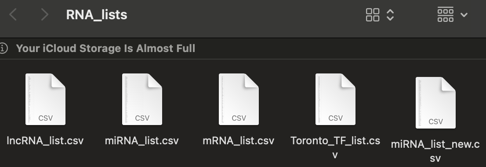
<figcaption><strong>Figure 18.</strong>Curated RNA reference lists and file organization.</figcaption>
</figure>

The process implemented in the code adds the gene names and types corresponding to the Ensembl IDs under the headings **"Male BRCA", "Female BRCA" and "Prostate"** to the relevant columns. The version numbers in the Ensembl IDs are also cleaned (e.g. .1, .2 etc.).

```{python}
import pandas as pd

# Define the file paths
unnamed_path = "/Users/ecemsorucu/Desktop/unlabeled_genes.csv"
tcga_path = "/Users/ecemsorucu/Desktop/Project_1/BreastCancer/Male_BRC/normal_TCGA.csv"

# Load the input CSV files
unnamed_df = pd.read_csv(unnamed_path)
tcga_df = pd.read_csv(tcga_path, sep="\t")

# Remove version numbers from Ensembl IDs
tcga_df["gene_id"] = tcga_df["gene_id"].str.replace(r"\.\d+$", "", regex=True)

# Extract unique gene information
tcga_info = tcga_df[["gene_id", "gene_name", "gene_type"]].drop_duplicates()

# Define the function for annotation
def enrich_column(df, column_name, symbol_col, type_col):
    df[column_name] = df[column_name].str.strip()
    match = df[[column_name]].merge(tcga_info, how="left", left_on=column_name, right_on="gene_id")
    df[symbol_col] = match["gene_name"]
    df[type_col] = match["gene_type"]
    return df

# Annotate each dataset column
unnamed_df = enrich_column(unnamed_df, "Male BRCA", "Symbol", "Type")
unnamed_df = enrich_column(unnamed_df, "Female BRCA", "Symbol.1", "Type.1")
unnamed_df = enrich_column(unnamed_df, "Prostate", "Symbol.2", "Type.2")

# Save the annotated dataset
output_path = "/Users/ecemsorucu/Desktop/unlabeled_genes_annotated.csv"
unnamed_df.to_csv(output_path, index=False)
```


Differentially expressed genes (DEGs) filtered according to statistical thresholds were re-imported to be used in further analysis. In this step, the previously exported file containing the gene list selected according to both statistical significance and sufficient expression level criteria was read via pandas library and re-introduced into the analysis environment. Thus, only significant and biologically interpretable genes were used to continue working.

```{python}
import pandas as pd

# Load the filtered list of differentially expressed genes (DEGs)
deg_list = pd.read_csv("Users/ecemsorucu/Desktop/Prostate_Bowtie2_DESeq2_filtered.csv", sep="\t")
deg_list
```


In order to compare the results obtained from differential gene expression analysis with other RNA types (e.g. mRNA, lncRNA, miRNA), the reference gene lists needed to be structurally cleaned. In this step, the cases where the gene symbols in the mRNA list contained more than one symbol were addressed, and the multiple symbols separated by `“;”` were converted to open each on a separate line. This process is necessary for accurate and comprehensive gene matches during the analysis. The cleaned and expanded mRNA list was re-saved and made ready to be used in the next steps.

```{python}
# Load the mRNA list
mRNA = pd.read_csv("/Users/ecemsorucu/Desktop/RNA_lists/mRNA_list.csv")

# Split entries with multiple symbols separated by ';' and expand them into separate rows
mRNA = (mRNA["Symbol"].str.split(";")).explode("Symbol")

# Save the cleaned and exploded list back to CSV with tab separator
mRNA.to_csv("/Users/ecemsorucu/Desktop/RNA_lists/mRNA_list.csv", sep="\t", index=False)

# Display the resulting DataFrame
mRNA
```

The filtered differential gene list was compared with the reference mRNA list to identify common genes. In this step, an inner join was performed between the two lists and only genes that were found to be significant by DESeq2 analysis and were included in the mRNA list were obtained. Thus, the scope of the analysis was limited to only mRNAs with significantly changed expression levels. The resulting mRNA-specific DEG list was exported to be used in subsequent biological interpretation and functional analyses.


```{python}
# Merge the DEG list with the mRNA list to retain only common genes (inner join)
mRNA_list = pd.merge(deg_list, mRNA, how="inner")

# Save the filtered mRNA DEG list as a tab-separated CSV file
mRNA_list.to_csv("Users/ecemsorucu/Desktop/Prostate_Bowtie2_mRNA.csv", sep="\t", index=False)
```


In order to examine potential interactions with differentially expressed genes, the curated miRNA list used in the study was included in the analysis environment. In this step, the file containing miRNAs collected from external sources and determined to be biologically significant was read using the pandas library and loaded as a data frame. Thus, the miRNA data required for further comparisons and target gene analyses were prepared.

```{python}
# Read the curated list of miRNAs from a CSV file
miRNA = pd.read_csv("//Users/ecemsorucu/Desktop/RNA_lists/miRNA_list_new.csv")
miRNA
```


In order to identify miRNAs within the differentially expressed genes, DESeq2 results were compared with the reference miRNA list. Before this comparison, in order to avoid naming inconsistencies, miRNA symbols in both lists were converted to lowercase and converted to a standard format (e.g. “MIR” → “miR-”). This step is critical for accurate list matching. Then, an inner join was performed between the two lists and only miRNAs that were found to be significant by both DESeq2 analysis and were included in the reference list were filtered. Finally, the obtained matching miRNAs were converted back to the conventional format and saved in a new file. This list will be used in further analyses to examine potential regulatory roles.

```{python}
import pandas as pd

# Read the DESeq2 filtered results (differentially expressed genes)
deg_list = pd.read_csv("Users/ecemsorucu/Desktop/Prostate_Bowtie2_DESeq2_filtered.csv", sep = "\t")

# Standardize miRNA naming: convert "MIR" to "miR-" and lowercase for consistent comparison
deg_list["Symbol"] = deg_list["Symbol"].str.replace("MIR", "miR-").str.lower()
deg_list

# Read the reference miRNA list and convert all symbols to lowercase
miRNA = pd.read_csv("/Users/ecemsorucu/Desktop/RNA_lists/miRNA_list_new.csv")
miRNA["Symbol"] = miRNA["Symbol"].str.lower()
miRNA

# Find intersecting miRNAs between DEGs and reference list
miRNA_list = pd.merge(deg_list, miRNA, how="inner")
miRNA_list

# Restore conventional formatting by converting "mir" to "miR"
miRNA_list["Symbol"] = miRNA_list["Symbol"].str.replace("mir", "miR")

# Save the final filtered miRNA DEGs to a new file
miRNA_list.to_csv("Users/ecemsorucu/Desktop/Prostate_Bowtie2_miRNA.csv", sep="\t", index=False)
```

In order to determine the transcription factors (TF) included in the results obtained from the differential gene expression analysis, the analysis output was compared with a reference TF list. In this process, an inner join was applied between the genes found significant with DESeq2 and the TF list created based on the literature, and only the genes found in common in both lists were filtered. Thus, only differentially expressed transcription factors were obtained. Since these genes are of special importance in terms of genetic regulation mechanisms, they were recorded in a separate file to be evaluated in advanced functional analyses.

```{python}
import pandas as pd

# Load the filtered list of differentially expressed genes (DEGs)
deg_list = pd.read_csv("Users/ecemsorucu/Desktop/Prostate_Bowtie2_DESeq2_filtered.csv", sep="\t")
deg_list

# Load the reference list of transcription factors (TFs)
TF = pd.read_csv("/Users/ecemsorucu/Desktop/RNA_lists/Toronto_TF_list.csv")
TF

# Identify TFs that are also present in the DEGs by performing an inner merge
TF_list = pd.merge(deg_list, TF, how="inner")

# Save the resulting transcription factor DEG list to a new file
TF_list.to_csv("Users/ecemsorucu/Desktop/Prostate_Bowtie2_TF.csv", sep="\t", index=False)
```

In order to identify differentially expressed long non-coding RNAs (lncRNAs), the gene list obtained from DESeq2 analysis was compared with a reference lncRNA list. This comparison was performed by inner join method and only genes that were common to both lists were filtered. Thus, only lncRNAs showing significant expression changes were obtained. These genes were recorded in a separate file to be evaluated in terms of biological significance in further analyses, especially because they play a role in gene regulation at transcriptional and post-transcriptional levels.

```{python}
import pandas as pd

# Load the filtered list of differentially expressed genes (DEGs)
deg_list = pd.read_csv("Users/ecemsorucu/Desktop/Prostate_Bowtie2_DESeq2_filtered.csv", sep="\t")
deg_list 

# Load the reference list of long non-coding RNAs (lncRNAs)
lncRNA = pd.read_csv("/Users/ecemsorucu/Desktop/RNA_lists/lncRNA_list.csv")
lncRNA

# Match DEGs with the lncRNA list to extract differentially expressed lncRNAs
lncRNA_list = pd.merge(deg_list, lncRNA, how="inner")

# Save the resulting lncRNA DEG list to a new file
lncRNA_list.to_csv("Users/ecemsorucu/Desktop/Prostate_Bowtie2_lncRNA.csv", sep="\t", index=False)
```

As a result, within the significant gene expressions of female breast, male breast and prostate data, literature-verified lncRNA, miRNA, mRNA and TFs were separately identified and relevant sublists were created.


## Step 4 - Comparison and Interpretation of Differentially Expressed Genes

The resulting gene lists were created as in the Venn diagrams presented in [Figure 19.](#figA) . To create the diagram in [Figure 19.](#figA)**(A)**, a comparison was made between female breast, male breast and prostate samples based on the data obtained with the STAR and Bowtie2 alignment tools. In the Venn diagram shown in [Figure 19.](#figA)**(B)**, separate clustering was performed for the results obtained with STAR and for the results obtained with Bowtie2. miRNA, lncRNA, mRNA and transcription factors (TF) were clustered and compared separately. Sample Python codes for these clustering and comparison processes are presented below.


<figure id="figA">
    
    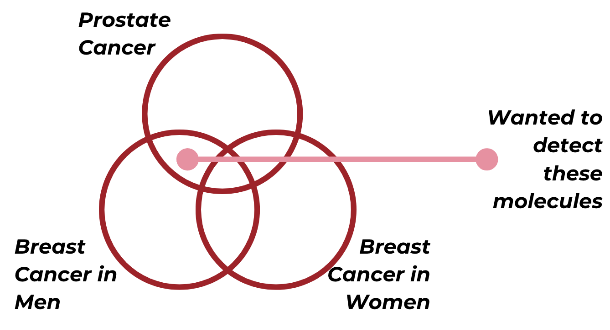
<figcaption><strong>Figure 19.</strong>CA. Clustering of results obtained from two different alignment tools, B. Clustering of results obtained from DESeq2 Analysis.</figcaption>
</figure>

**Clustering of Results Obtained From STAR and Bowtie2:**

%The intersections that are acquired will then be compared to one another. Initially, `Venny` will be used to compare breast tissue samples from males and females, extracting just the gene names found in males. Then, using `Venny`, these gene names will be grouped once more with the prostate tissue data, with particular attention paid to genes found at the intersection. Common molecules will be recognized in this manner. Ne vennysi Ecemmy


The code below provides a venn diagram comparing DESeq2 outputs of "Male breast" data after alignment with STAR and Bowtie2. The same procedure was performed for mRNA, miRNA, lncRNA and TF results. The same procedure was performed for "Female breast" and "Prostate".

```{python}
import pandas as pd
import os
from matplotlib import pyplot as plt
from matplotlib_venn import venn2

# Define output directory
output_folder = "/Users/ecemsorucu/Desktop/Project_1/VennComparison/MaleBRCA/DESEQ2"

if not os.path.exists(output_folder):
    os.makedirs(output_folder)

# Load DESeq2 filtered results
bowtie_df = pd.read_csv("/Users/ecemsorucu/Desktop/Project_1/BreastCancer/Male_BRC/MaleBRCA_Bowtie2/MaleBrca_Bowtie2_DESeq2_filtered.csv", sep="\t")
star_df = pd.read_csv("/Users/ecemsorucu/Desktop/Project_1/BreastCancer/Male_BRC/MaleBrca_Star_DESeq2_filtered.csv", sep="\t")

# Convert the "Symbol" columns to sets
bowtie_genes = set(bowtie_df['Symbol'].dropna())
star_genes = set(star_df['Symbol'].dropna())

# Generate a Venn diagram with pastel colors
plt.figure(figsize=(8, 8))
venn = venn2([bowtie_genes, star_genes], set_labels=('Bowtie2', 'STAR'))

# Apply pastel colors
venn.get_patch_by_id('10').set_color('#A1C9F4')  # Bowtie2 only
venn.get_patch_by_id('01').set_color('#FFB482')  # STAR only
venn.get_patch_by_id('11').set_color('#B6E3A1')  # Shared

# Set transparency
for subset in ('10', '01', '11'):
    venn.get_patch_by_id(subset).set_alpha(0.8)

# Customize label font
for text in venn.set_labels:
    text.set_fontsize(14)
    text.set_color("black")

# Add title and save the figure
plt.title("DESeq2 Result Comparison Between STAR and Bowtie2 Alignment", fontsize=14)
plt.savefig(output_folder + "/venn_diagram_star_vs_bowtie2_pastel.png")
plt.show()

# Identify intersections and unique gene sets
common_genes = bowtie_genes & star_genes
only_bowtie = bowtie_genes - star_genes
only_star = star_genes - bowtie_genes

# Save gene sets to CSV files
pd.DataFrame(common_genes, columns=["Common_DEGs"]).to_csv(output_folder + "/common_genes.csv", index=False)
pd.DataFrame(only_bowtie, columns=["Only_in_Bowtie2"]).to_csv(output_folder + "/only_bowtie2.csv", index=False)
pd.DataFrame(only_star, columns=["Only_in_STAR"]).to_csv(output_folder + "/only_star.csv", index=False)

# Write a summary text file
with open(output_folder + "/summary.txt", "w") as f:
    f.write(f"Common DEGs in both STAR and Bowtie2: {len(common_genes)}\n")
    f.write(f"DEGs only in Bowtie2: {len(only_bowtie)}\n")
    f.write(f"DEGs only in STAR: {len(only_star)}\n")

print(f"All output files have been saved to: {output_folder}")
```

**Clustering of Results Obtained From Molecular Common Lists:**

The code below gives a venn diagram comparing mRNA outputs of datasets after alignment with STAR. The same procedure was performed for miRNA, lncRNA, TF and even DESeq2 results. The same procedure was performed by changing the necessary file sequences after alignment with Bowtie2.

```{python}

import pandas as pd
import os
from matplotlib import pyplot as plt
from matplotlib_venn import venn3_unweighted

# Set the output directory
output_folder = "/Users/ecemsorucu/Desktop/Project_1/VennResults/"
if not os.path.exists(output_folder):
    os.makedirs(output_folder)

# Load CSV files (tab-delimited)
male = pd.read_csv("/Users/ecemsorucu/Desktop/Project_1/BreastCancer/Male_BRC/MaleBrca_STAR_mRNA.csv", sep="\t")
female = pd.read_csv("/Users/ecemsorucu/Desktop/Project_1/BreastCancer/Female_BRC/FemBrca_STAR_mRNA.csv", sep="\t")
prostate = pd.read_csv("/Users/ecemsorucu/Desktop/Project_1/ProstateCancer/Prostate_STAR_mRNA.csv", sep="\t")

# Convert 'Symbol' columns into sets
male_genes = set(male['Symbol'].dropna())
female_genes = set(female['Symbol'].dropna())
prostate_genes = set(prostate['Symbol'].dropna())

# Create unweighted Venn diagram
plt.figure(figsize=(8, 8))
venn3_unweighted([male_genes, female_genes, prostate_genes],
                 set_labels=('Male BRCA', 'Female BRCA', 'Prostate CA'))
plt.title("mRNA List Comparison (STAR)")
plt.savefig(output_folder + "venn_diagram_equal_circles.png")
plt.show()

# Calculate intersections and unique sets
intersection_all = male_genes & female_genes & prostate_genes
only_male = male_genes - (female_genes | prostate_genes)
only_female = female_genes - (male_genes | prostate_genes)
only_prostate = prostate_genes - (male_genes | female_genes)
male_female_only = (male_genes & female_genes) - prostate_genes
male_prostate_only = (male_genes & prostate_genes) - female_genes
female_prostate_only = (female_genes & prostate_genes) - male_genes

# Save each result set as a CSV file
pd.DataFrame(intersection_all, columns=["Common to All Three"]).to_csv(output_folder + "intersection_all.csv", index=False)
pd.DataFrame(only_male, columns=["Only Male BRCA"]).to_csv(output_folder + "only_male.csv", index=False)
pd.DataFrame(only_female, columns=["Only Female BRCA"]).to_csv(output_folder + "only_female.csv", index=False)
pd.DataFrame(only_prostate, columns=["Only Prostate CA"]).to_csv(output_folder + "only_prostate.csv", index=False)
pd.DataFrame(male_female_only, columns=["Only Male and Female"]).to_csv(output_folder + "only_male_female.csv", index=False)
pd.DataFrame(male_prostate_only, columns=["Only Male and Prostate"]).to_csv(output_folder + "only_male_prostate.csv", index=False)
pd.DataFrame(female_prostate_only, columns=["Only Female and Prostate"]).to_csv(output_folder + "only_female_prostate.csv", index=False)

# Create a summary file
with open(output_folder + "summary.txt", "w") as f:
    f.write(f"Number of genes common to all three groups: {len(intersection_all)}\n")
    f.write(f"Number of genes unique to Male BRCA: {len(only_male)}\n")
    f.write(f"Number of genes unique to Female BRCA: {len(only_female)}\n")
    f.write(f"Number of genes unique to Prostate CA: {len(only_prostate)}\n")
    f.write(f"Number of genes shared by Male and Female BRCA only: {len(male_female_only)}\n")
    f.write(f"Number of genes shared by Male BRCA and Prostate CA only: {len(male_prostate_only)}\n")
    f.write(f"Number of genes shared by Female BRCA and Prostate CA only: {len(female_prostate_only)}\n")

print(f"All output files have been saved to: {output_folder}")
```


### Z-score Analysis
A standardized statistic called the Z-score shows how much a given value deviates from the distribution mean in terms of standard deviations (Javaheri et al., 2013).  It is described as:

$$
Z = \frac{x - \mu}{\sigma}
$$

where:

- $x$ is the observed value (e.g., the log₂ fold change of a gene),
- $\mu$ is the mean of the values in the group,
- $\sigma$ is the standard deviation of the group.

DESeq2 was used in this work to collect lists of differentially expressed genes, and log₂ fold change (log₂FC) values were produced. However, as seen in Table 1, there is a notable sample size disparity among the three datasets: Male Breast, Female Breast, Prostate.

Specifically, in the male breast cancer sample, this imbalance resulted in higher variation and possible outliers in the log₂FC values. Therefore, comparing raw log₂FC values from various datasets directly may result in inaccurate or biased conclusions (Soneson & Delorenzi, 2013).

Z-score normalization was used to level the playing field between the two datasets, allowing for more accurate correlation analysis and more equitable comparison.


Every data type (mRNA, lncRNA, miRNA, and TF) underwent a distinct Z-score normalization procedure.  Python's `scipy.stats` module's `zscore()` function was used to standardize the log₂FC values for each list.  The log₂FC value for each gene was normalized using the dataset's mean and standard deviation.

 This normalization reduced the impact of outliers and sample size disparities, allowing the correlation analysis to concentrate on expression patterns.


The resulting Z-scores for each gene group are summarized in **Table 1**. It was unable to calculate the association between the male breast and prostate groups since there was just one shared gene in the miRNA list produced by the STAR aligner.

###### Table 1. Z-score normalized correlation values of intersecting gene sets (log₂FC) for STAR and Bowtie2 aligners.

| Aligner | mRNA  | lncRNA | miRNA  | TF     |
|---------|------|--------|--------|--------|
| STAR    | 0.4644 | 0.3543 | --     | 0.6128 |
| Bowtie2 | 0.2069 | 0.0401 | -0.1636 | 0.2428 |


As shown in [Figure 19.](#figA)**(B)**, the intersection of male breast cancer and prostate cancer was examined by considering the area outside the female breast cancer cluster. Due to the imbalance of tumor and normal sample numbers in the data sets and the general difference in sample numbers, it was deemed appropriate to apply Z-score analysis for the molecule lists belonging to the “male\_prostate\_only” cluster obtained in the Venn diagram. This method was preferred to reduce the effect of the variability in the number of samples in the interpretation of differential gene expression.

```{python}
import pandas as pd
from scipy.stats import zscore

# Set file paths
only_male_prostate_path = "/Users/ecemsorucu/Desktop/Proje_1/VennSonuclar_lncRNA/only_male_prostate.csv"
male_brca_path = "/Users/ecemsorucu/Desktop/Proje_1/BreastCancer/Male_BRC/MaleBrca_STAR_lncRNA.csv"
prostate_path = "/Users/ecemsorucu/Desktop/Proje_1/ProstateCancer/Prostate_STAR_lncRNA.csv"
output_path = "/Users/ecemsorucu/Desktop/merged_log2fc_STAR_lncRNA.csv"

# Read the files
only_male_prostate = pd.read_csv(only_male_prostate_path)
male_brca = pd.read_csv(male_brca_path, sep='\t')
prostate = pd.read_csv(prostate_path, sep='\t')

# Extract gene names
genes = only_male_prostate.iloc[:, 0]

# Extract only the Symbol and log2FoldChange columns
male_brca_fc = male_brca[['Symbol', 'log2FoldChange']].rename(columns={'Symbol': 'gene', 'log2FoldChange': 'Male BRCA'})
prostate_fc = prostate[['Symbol', 'log2FoldChange']].rename(columns={'Symbol': 'gene', 'log2FoldChange': 'Prostate'})

# Merge based on gene symbols
merged_df = pd.DataFrame({'gene': genes})
merged_df = merged_df.merge(male_brca_fc, on='gene', how='left')
merged_df = merged_df.merge(prostate_fc, on='gene', how='left')

# Drop rows with NaN values for clean correlation
filtered_df = merged_df.dropna(subset=['Male BRCA', 'Prostate'])

# Z-score normalization
filtered_df['BRCA_z'] = zscore(filtered_df['Male BRCA'])
filtered_df['Prostate_z'] = zscore(filtered_df['Prostate'])

# Pearson correlation on Z-scores
zscore_corr = filtered_df[['BRCA_z', 'Prostate_z']].corr(method='pearson').iloc[0, 1]
print(f"\n�� Pearson correlation between Z-scored Male BRCA and Prostate log2FC: {zscore_corr:.4f}")

# Add z-score correlation to all rows (same value)
filtered_df['Zscore_Pearson_corr'] = zscore_corr

# Save updated file
filtered_df.to_csv(output_path, index=False)
print(f"\n✅ Final file with Z-score and correlation saved to: {output_path}")
```

### KEGG

The goal of the study is to learn more about the biological functions and interactions of the substances and genes that have been found. KEGG (Kanehisa et al., 2016) was used to perform pathway analysis for these common genes. By examining the biological roles of cancer-related genes and the pathways that are connected to them, KEGG improves the project's usefulness.

KEGG is a gene and genome encyclopedia. At the molecular and higher levels, its main goal is to provide genes and genomes with functional meanings (Kanehisa et al., 2016). Molecular-level interpretations will be provided using pathway maps acquired via KEGG.

The Z-score values for each chemical and cancer type were used to build lists, which were then attempted to be interpreted.  The Z-score values and the lists of mRNA and lncRNA produced by two distinct alignment programs were combined, and the WEB-based GEne SeT AnaLysis Toolkit [(WebGestalt)](\url{https://www.webgestalt.org/}) was used for analysis.  The interface shown in the figure \ref{fig:kegg} below was utilized during the study, and it was via this interface that the appropriate variables were chosen.

<figure id="kegg">
    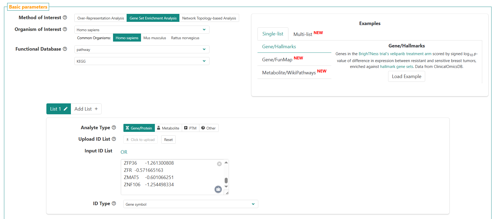
<figcaption><strong>Figure 20.</strong>WEB-based GEne SeT AnaLysis Toolkit interface</figcaption>
</figure>

### Enrichr

Functional enrichment analysis was carried out for the identified important lncRNA genes in this study using a web-based analytic program called [Enrichr](\url{https://maayanlab.cloud/Enrichr/}). This technique, which is based on the ORA (Over-Representation Analysis) concept, statistically assesses the overlaps between the gene list and gene clusters in certain databases, in contrast to the traditional GSEA method.

 During the analysis, no expression level (fold change, p-value, or Z-score) was input into Enrichr.  Rather, the analysis was conducted using only the important lncRNA names, and the biological processes, transcription factors (TFs), epigenetic regulators, or illnesses that were linked to this list were disclosed.

 The Kyoto Encyclopedia of Genes and Genomes (KEGG) database was also assessed in this regard; however, because KEGG's present content mostly focuses on protein-coding genes (mRNA), it proved inadequate for lncRNAs.  Only through linked mRNAs can KEGG analysis demonstrate how lncRNAs affect pathways indirectly.  This circumstance restricts the ability to analyze lncRNAs in a meaningful way, particularly those that operate through miRNAs and TFs or have a direct functional role.  Consequently, more functional and hypothesis-oriented results were obtained from studies carried out using tools like Enrichr, which comprise bigger and experimentally based datasets.

<figure id="enrichr">
    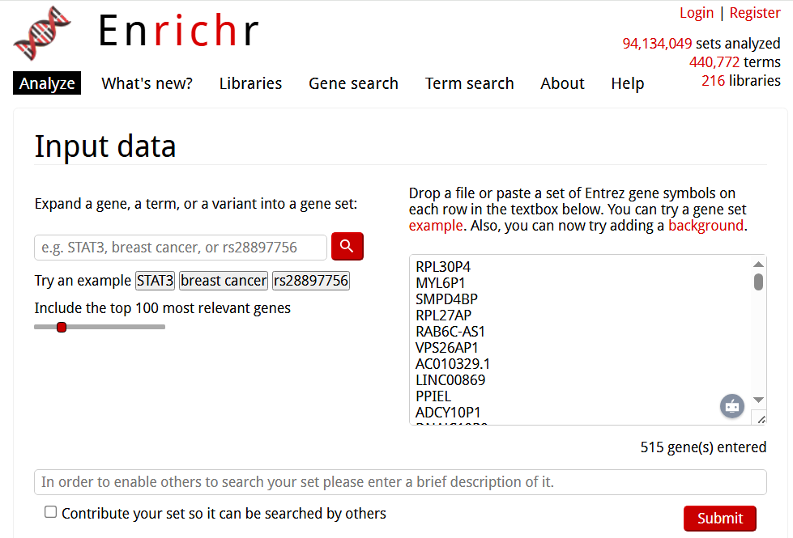
<figcaption><strong>Figure 21.</strong> Enrichr interface.</figcaption>
</figure>
 
### DIANA miRPath v4.0 and mirTarBase

DIANA-miRPath v4.0 is a tool for functional analysis that assesses how miRNAs affect biological pathways, using information from the KEGG and GO databases [DIANA](\url{https://dianalab.e-ce.uth.gr/tools}). For this analysis, the "miRNA-centric analysis" option was chosen, and the specific settings were as shown in Figure \ref{fig:mirpath}. Unlike miRTarBase, the main aim of the DIANA-miRPath analysis was to understand the biological pathways that the target molecules influence or change, rather than focusing solely on the target molecules themselves.


<figure id="mirpath">
    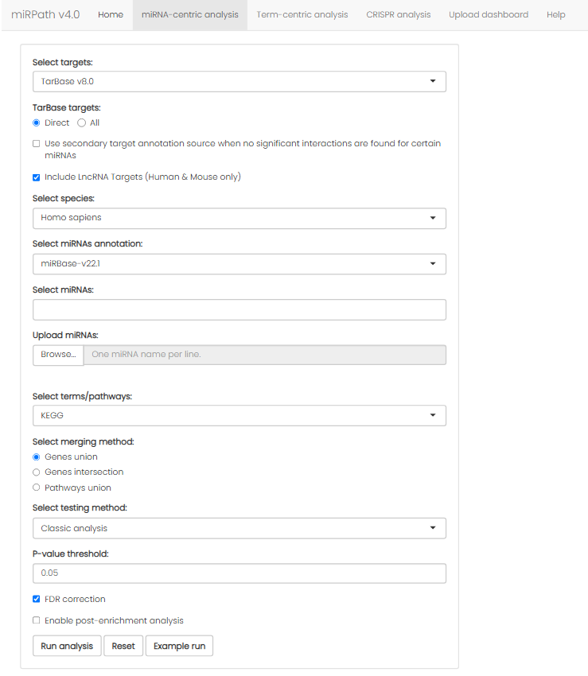
<figcaption><strong>Figure 22.</strong> DIANA-miRPath v4.0 interface.</figcaption>
</figure>

MicroRNAs (miRNAs) that were found in both male breast and prostate cancer datasets, but not in female breast cancer, and were consistently identified by both STAR and Bowtie2 alignment tools, were analyzed using miRTarBase and DIANA-miRPath v4.0.


<figure id="mirtarbase">
    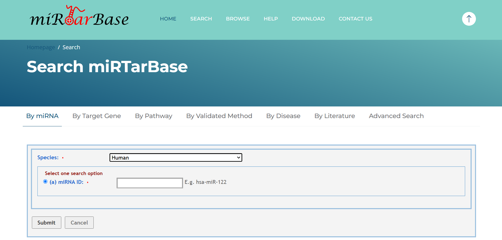
<figcaption><strong>Figure 23.</strong> miRTarBase interface.</figcaption>
</figure>

 [miRTarBase](\url{https://awi.cuhk.edu.cn/~miRTarBase/miRTarBase_2025/php/search.php}) is a dependable database containing miRNA-target gene interactions that have been verified through experiments. The list of target molecules from miRTarBase was compared with the downregulated long non-coding RNAs (lncRNAs), messenger RNAs (mRNAs), and transcription factors identified in our study. Molecules that appeared in both lists were then thoroughly investigated using existing scientific literature.


# References
- Spencer, D. H., Sehn, J. K., Abel, H. J., et al. (2013). Comparison of clinical targeted next-generation sequencing data from formalin-fixed and fresh-frozen tissue specimens. *Journal of Molecular Diagnostics*, 15, 623–633.

- Javaheri, S. H., Sepehri, M. M., & Teimourpour, B. (2013). Response modeling in direct marketing: A data mining-based approach for target selection. *Data Mining Applications with R*, 153–180. https://doi.org/10.1016/B978-0-12-411511-8.00006-2

- Soneson, C., & Delorenzi, M. (2013). A comparison of methods for differential expression analysis of RNA-seq data. *BMC Bioinformatics*, 14, 1–18. https://doi.org/10.1186/1471-2105-14-91

- Zhang, X., Wang, W., Zhu, W., et al. (2019). Mechanisms and functions of long non-coding RNAs at multiple regulatory levels. *International Journal of Molecular Sciences*, 20, 5573.

- Kanehisa, M., Furumichi, M., Tanabe, M., Sato, Y., & Morishima, K. (2016). KEGG: New perspectives on genomes, pathways, diseases and drugs. *Nucleic Acids Research*, 45, D353–D361.

